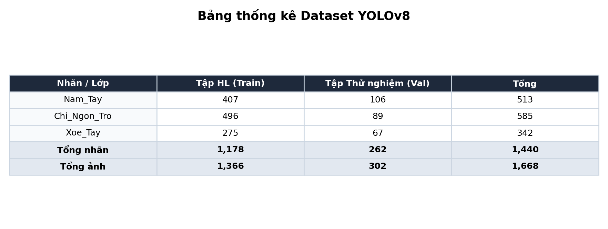
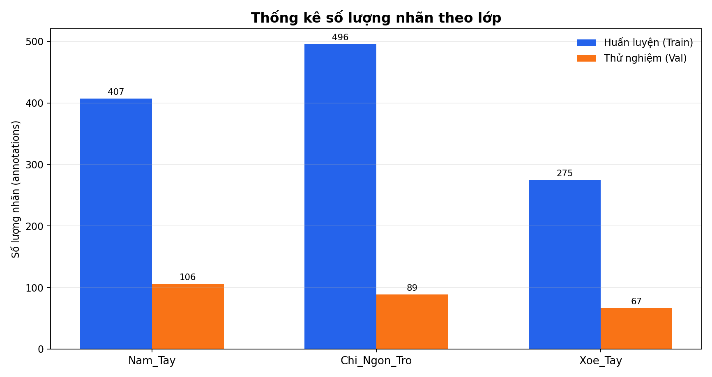
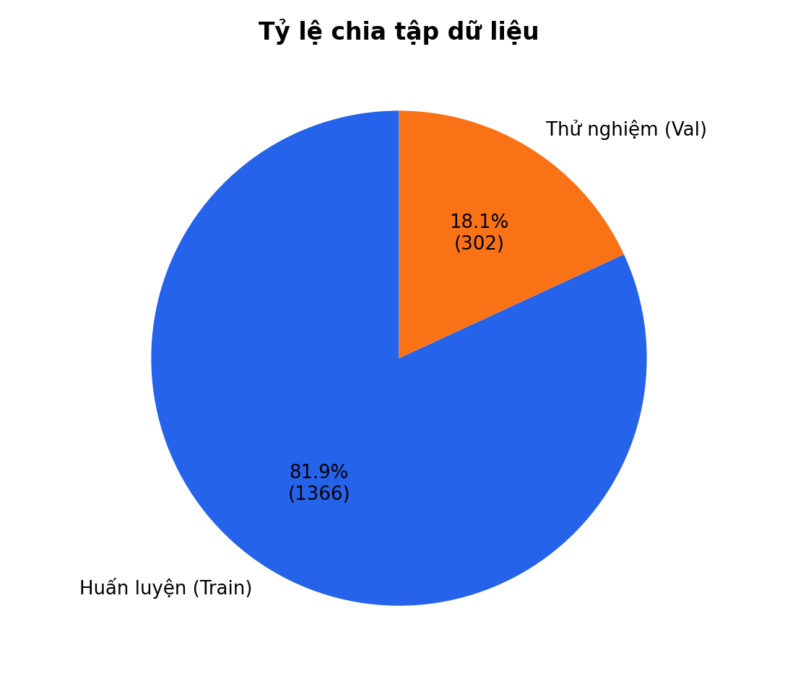
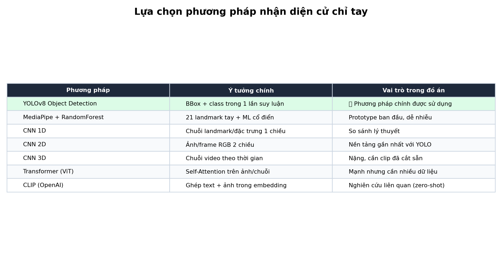
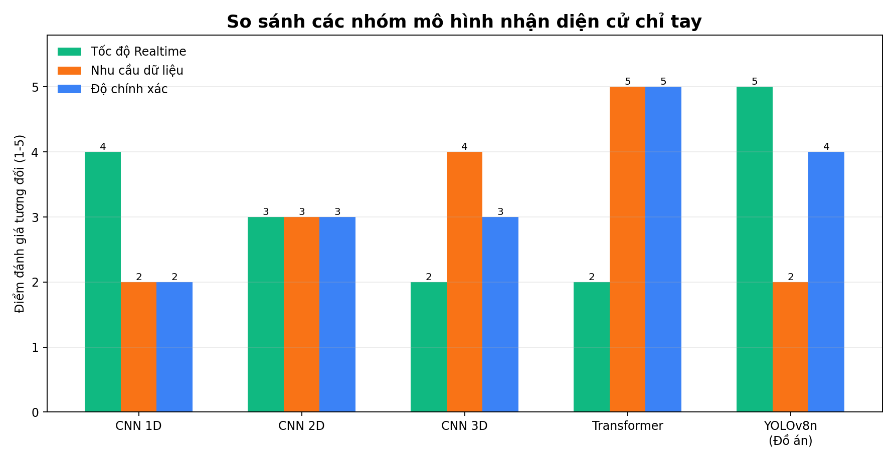
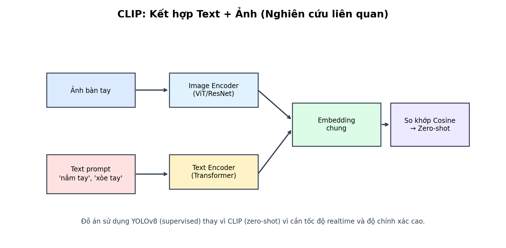
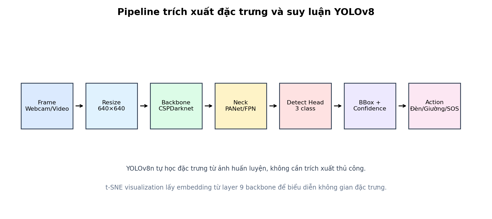
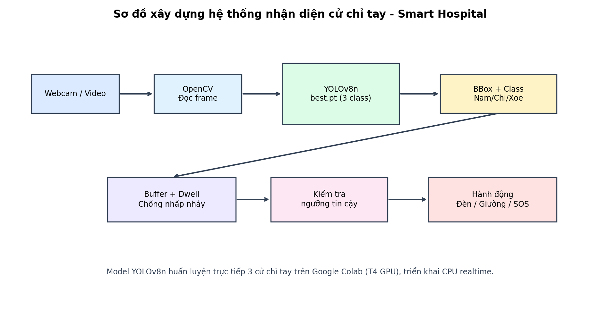
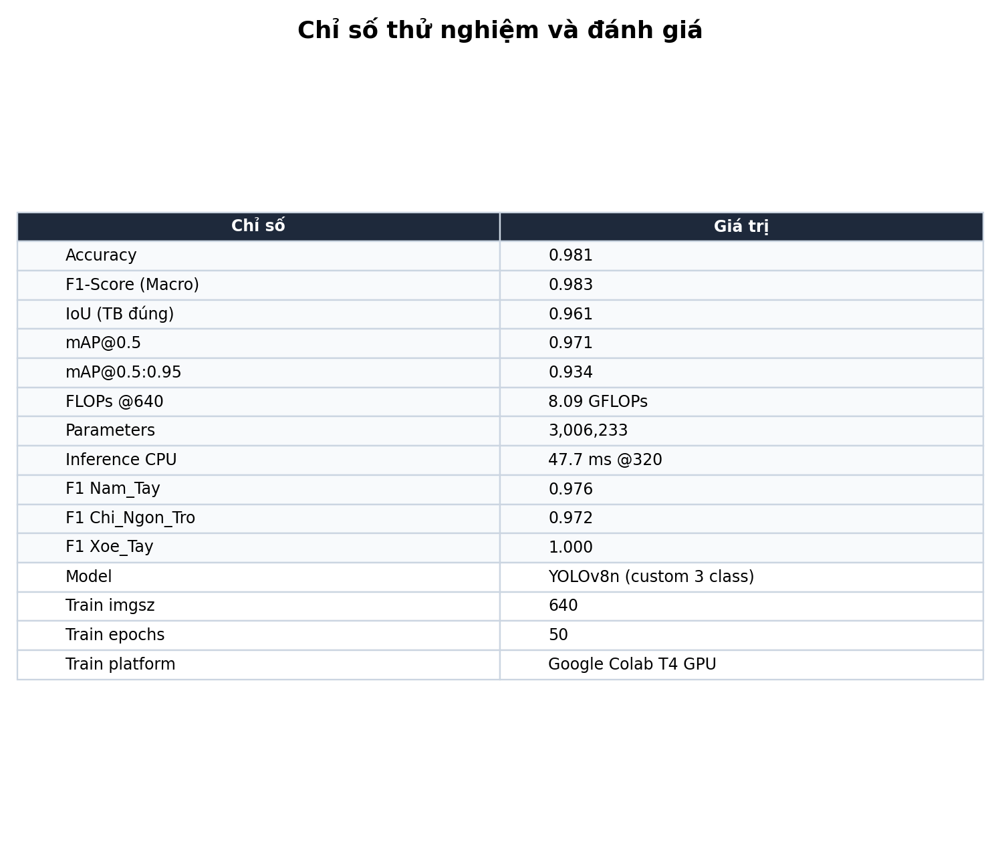
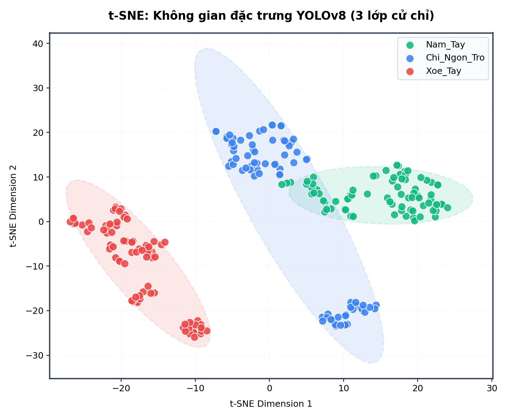

# Báo cáo asset hệ thống

## Model đang dùng

- File model chính: `D:/DEV_AI/best (1).pt`
- `best.pt` cũ không còn được script chạy mặc định sử dụng.
- Checkpoint online: `yolov8x.pt`, task detect, train imgsz `640`, epochs `10`.
- Class trong model: `A, B, C, D, E, F, G, H, I, L, M, N, O, P, R, S, T, U, V, W, Y`.

## Mapping cử chỉ

| Cử chỉ hệ thống | Class ASL dùng | Hành động |
|---|---|---|
| Nam_Tay | A, S | Bật/tắt đèn |
| Chi_Ngon_Tro | D, G, L | Điều chỉnh giường |
| Xoe_Tay | B | SOS |

Class ASL khác được xem là `Binh_Thuong` để giảm kích hoạt nhầm.

## Dataset

Tổng số ảnh hiện có: **1510**.

- Huấn luyện: **1208 ảnh**
- Thử nghiệm/Val: **302 ảnh**
- Test riêng: **0 ảnh**

| Nhãn | Huấn luyện | Thử nghiệm/Val | Test | Tổng |
|---|---:|---:|---:|---:|
| Binh_Thuong | 314 | 79 | 0 | 393 |
| Nam_Tay | 374 | 93 | 0 | 467 |
| Chi_Ngon_Tro | 313 | 78 | 0 | 391 |
| Xoe_Tay | 207 | 52 | 0 | 259 |

## Phương pháp và mô hình

## Trích xuất đặc trưng và hệ thống

## Thử nghiệm và đánh giá

Đánh giá dưới đây là phép đo proxy sau khi map class ASL sang nhãn hệ thống trên tập `dataset/images/val`. Đây không phải validation gốc của dataset ASL online.

| Chỉ số | Giá trị |
|---|---:|
| Accuracy | 0.328 |
| F1-Score | 0.247 |
| IoU | 0.834 |
| mAP@0.5 | 0.081 |
| mAP@0.5:0.95 | 0.057 |
| FLOPs 320 | 64.56 GFLOPs |
| FLOPs 640 | 258.23 GFLOPs |
| Parameter | 68,172,831 |
| Inference time CPU | 480.8 ms @320 |
| Val images | 302 |

